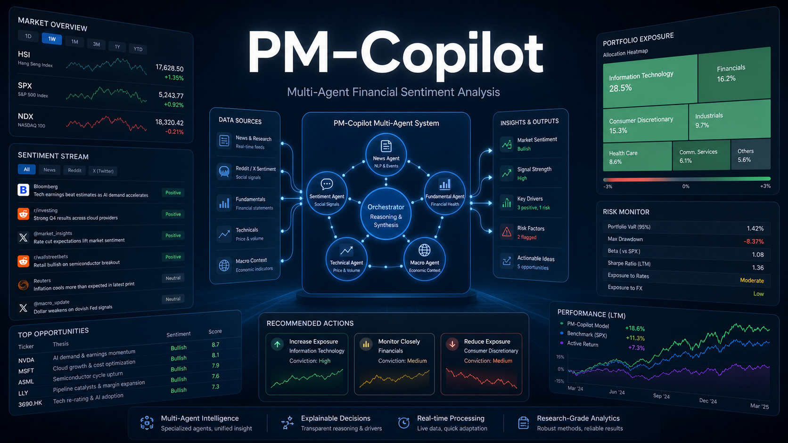
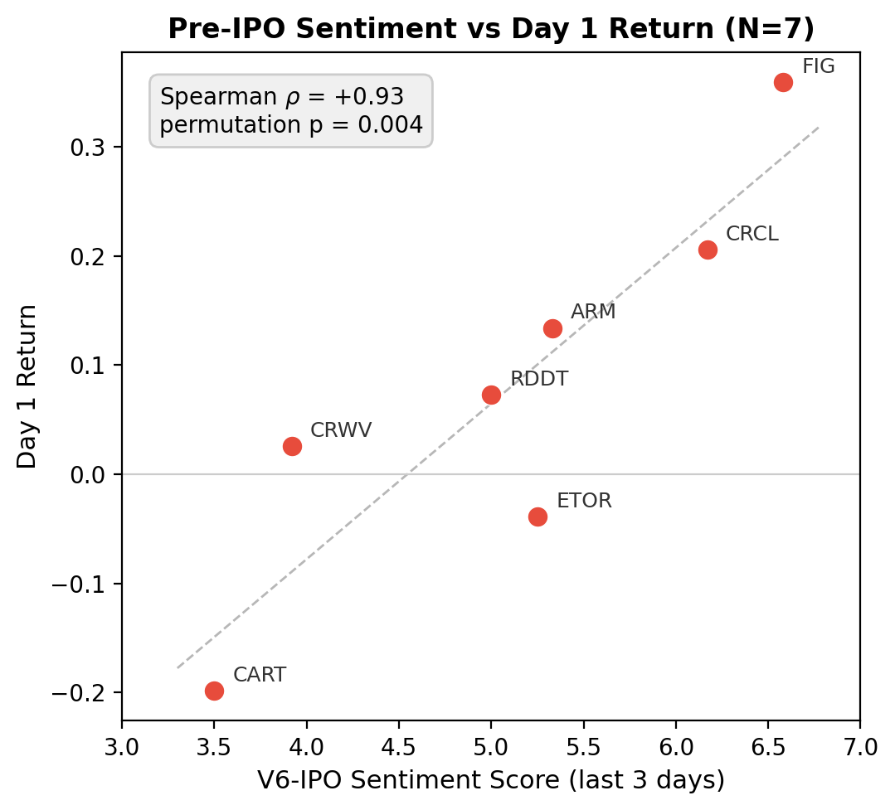
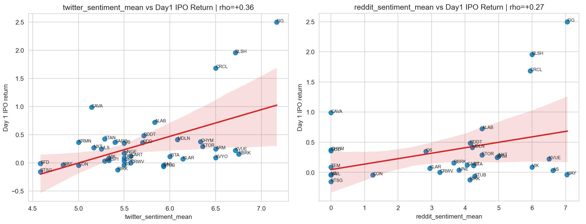

# PM-Copilot

### A Multi-Agent LLM System for Financial Sentiment Analysis and Its Application in Equity & IPO Markets

---

## Abstract

PM-Copilot is a portfolio-manager-oriented analytical co-pilot for monitoring financial markets, synthesizing multi-source sentiment, and supporting equity and IPO analysis. Instead of acting as an autonomous trading engine, the system organizes market, basket, and ticker-level evidence into a progressive dashboard so that human analysts can inspect signals, context, and limitations before making decisions.

This public repository currently hosts the project README, license, and demonstration material. The implementation code is still undergoing cleanup and will be uploaded later.

## Demo

Demo video: [PM-Copilot demo video](https://drive.google.com/file/d/11MKsQK9IBriqFKv95wr4F_3HXMTXyFNy/view?resourcekey).

## 📊 Performance Comparison Results

**Updated: May 1, 2026**

This section highlights PM-Copilot's IPO sentiment analysis results. Unlike an autonomous trading benchmark, these charts evaluate whether pre-IPO social sentiment provides decision-support signal for Day 1 IPO outcomes.

For the IPO use case, PM-Copilot uses an IPO-specific V6 prompt because pre-listing discussion differs from normal listed-equity sentiment. On the filtered seven-listing sample with at least two pre-IPO Reddit days, the final three-day pre-IPO sentiment score shows a strong positive relationship with Day 1 return.

*Pre-IPO sentiment and Day 1 return show Spearman ρ = +0.93 with permutation p = 0.004 on the focused seven-listing evaluation set.*

The broader IPO event-study also compares Twitter/X and Reddit sentiment means against Day 1 IPO return. This cross-sectional view shows that both social channels carry positive but noisier relationships in the full IPO sample, motivating the narrower IPO-specific prompt and final-window analysis above.

*Twitter/X and Reddit sentiment both trend positively against Day 1 IPO return in the broader cross-sectional sample, with Twitter/X showing the stronger raw association in this view.*

## Overview

PM-Copilot addresses the information overload faced by portfolio managers who track many markets, thematic baskets, and individual securities. The system combines structured market data with unstructured news and social sentiment, then presents the result through three levels of analysis:

| Level | Purpose |
| --- | --- |
| **Market** | Summarize broad market movement and identify regions or themes that need attention. |
| **Basket** | Explain thematic portfolio performance with catalysts, movers, and AI-generated commentary. |
| **Ticker** | Produce deeper single-name analysis from multiple specialist agents and a synthesis layer. |

## System Design

The project follows a hierarchical multi-agent design. Specialist agents collect and interpret different evidence streams, while a synthesis agent reconciles their outputs into analyst-facing summaries.

| Component | Role |
| --- | --- |
| News Agent | Tracks recent company and market news. |
| Reddit / X Sentiment Agents | Extract social discussion volume, tone, and event context. |
| Technical Agent | Reviews price movement and market behavior. |
| Fundamental Agent | Adds company-level financial and business context. |
| Macro Agent | Captures broader market and economic background. |
| Synthesis Agent | Combines specialist evidence into a concise portfolio-manager view. |
| Dashboard | Provides market, basket, and ticker-level progressive disclosure. |

## Data Sources

The prototype uses a mix of market, news, and social data channels, including:

- daily equity price and return data
- thematic basket and ticker metadata
- Reddit discussion threads and comments
- X / Twitter-style social sentiment signals
- web news and search results
- company fundamentals, filings, and IPO-related reference data where available

The current demo focuses on decision-support outputs rather than fully reproducible public data release.

## Results & Demonstration

The demonstration highlights four main capabilities:

- a market overview for quickly locating stressed regions, sectors, or baskets
- basket-level commentary that explains daily movement and possible catalysts
- ticker-level multi-agent analysis for deeper single-name investigation
- sentiment evaluation studies for listed-equity and IPO-related use cases

PM-Copilot is designed as an analytical interface for human judgment. It does not execute trades, allocate capital, or claim causal prediction from sentiment alone.

## Repository Status

This repository is intentionally lightweight at this stage.

- Public demo video: available above
- README and license: available in this repository
- Source code: under final cleanup and planned for later upload
- Full reproducibility package: not yet released

## 📜 License

This project is licensed under the MIT License - see the [LICENSE](LICENSE) file for details.

## 🙏 Acknowledgments

### Research Institution

- The Hong Kong University of Science and Technology (HKUST)
- [PEILab (Pervasive Intelligence Laboratory)](https://www.hkpeilab.com/)

### Faculty Advisors

- Prof. **Song GUO** - HKUST
- Prof. **Jie ZHANG** - HKUST

### Contributors

- Undergraduates: **Andy YUNG** (@Andy123qq4), **Lucas LI** (@lucashimselff), and **Teerth Jain** (@Hunter-175)
- Research Postgraduate: **Zeyu LIU** (MPhil)
